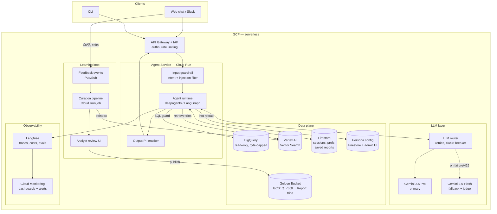
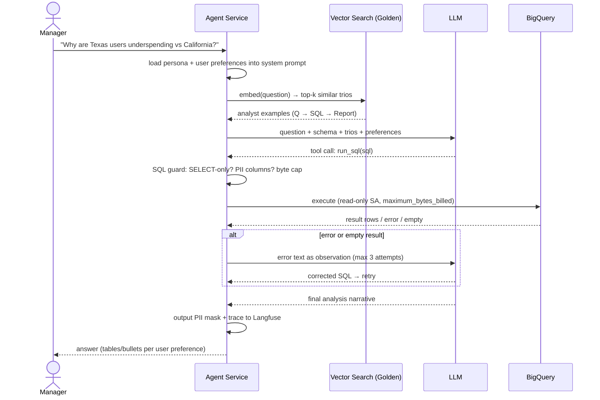
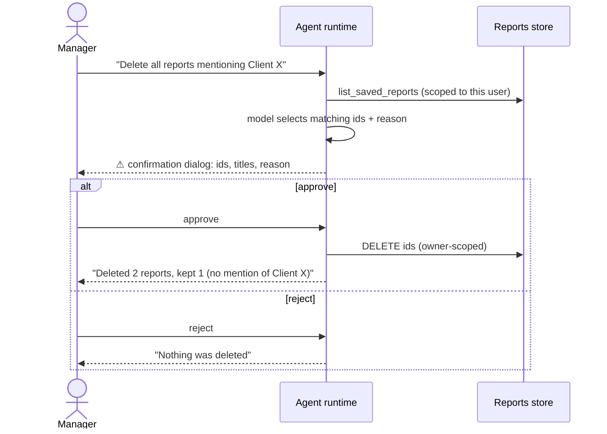
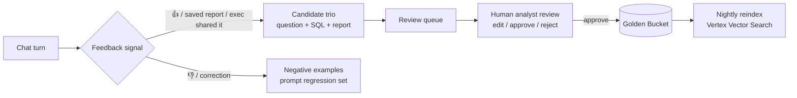

# Architecture — Data Analysis Chat Assistant

This document describes the production High-Level Design. The prototype in this
repository implements the same architecture end-to-end on lightweight local
substitutes (see [Prototype ↔ Production mapping](#prototype--production-mapping)).

## 1. System overview

**Compute**: everything is serverless (Cloud Run) — the agent is stateless
between turns; conversation state lives in Firestore (LangGraph checkpointer),
so any replica can serve any turn and scaling is horizontal per-request.

**Communication**: clients talk HTTPS/SSE (streaming tokens) to the Agent
Service; the agent talks to BigQuery/Firestore/Vector Search via Google client
libraries (IAM service accounts, no keys); feedback flows asynchronously
through Pub/Sub so the learning loop never blocks the chat path.

## 2. Query data flow

## 3. Destructive operations flow

The DB is read-only; the only destructive surface is the Saved Reports library.
Deletion is gated by a **hard interrupt** in the agent graph — the model cannot
execute the tool without an explicit human decision, and the approval is
enforced by the runtime (LangGraph human-in-the-loop), not by prompt goodwill.

UX notes: the flow adds exactly one click for the destructive case and zero
friction anywhere else; users can only ever delete their own reports (ownership
is enforced in the storage layer, not by the model).

## 4. Golden Bucket: the full pipeline

**What a trio is.** A JSON document of four fields: `question` (as an executive
would phrase it), `tags` (manual recall expanders — "churn" also matches
"retention" and "repeat"), `sql` (the analyst's query with conventions baked
in) and `report`. The `report` field is the analyst's *methodology*, not output
text: the churn trio, for example, records that this dataset has no
subscription table, so churn is defined operationally as the drop in
month-over-month repeat buying; that a spike must first be checked against
partial-month artifacts; and that proven facts must be kept separate from
hypotheses. 

**Retrieval (query time).** The system prompt obliges the agent to call
`search_golden_examples` before writing any SQL. In the prototype
(`src/tools/golden.py`) retrieval is lexical: the question is tokenized minus
stopwords and scored by Jaccard overlap against each trio's `question + tags`;
the top-2 matches are returned in full. In production the same interface is
served by Vertex AI Vector Search: `question + tags` are embedded — not the
SQL, because retrieval is by intent, not by implementation — and search is
semantic top-k gated by a **similarity threshold**: below it the tool honestly
answers "no similar past analyses found" instead of injecting a weak match,
since an irrelevant example misleads more than no example.

**Generation.** Matched trios enter the model context as past-analysis blocks
(question, analyst SQL, methodology). The agent transfers the conventions —
revenue excludes cancelled/returned items, how to decompose "underspending"
into conversion × frequency × basket size, the report structure executives
expect — onto the new question. This is few-shot transfer, not copy-paste: an
incoming question almost never matches a trio verbatim.

**Ingestion (over time)** — the bucket grows through a curated pipeline:

Key decisions:
- **Humans stay in the loop**: only analyst-approved trios enter the bucket, so
  one bad LLM answer can never poison future retrievals.
- **Dedup on ingest**: a candidate is compared by vector similarity against
  existing trios; near-duplicates reach the reviewer as "update existing"
  rather than "add new", keeping the bucket small and unambiguous.
- Negative feedback becomes eval cases, hardening the regression suite.
- Trios are versioned in GCS — bucket versioning doubles as an audit trail of
  who changed which convention; the index rebuild is a nightly batch job.

**Freshness.** A nightly job dry-runs every trio's SQL against the warehouse
(BigQuery `dry_run`, zero bytes billed). A trio whose SQL no longer validates —
schema drift, a renamed column — is quarantined out of retrieval before the
agent can copy a broken pattern, and lands in the review queue for repair.

**In the prototype** the capture step of this pipeline is the `/good` CLI
command: it assembles a candidate trio from the last exchange — the user's
question, every SQL query the agent executed for it, and the final report —
and writes it to `golden/candidates/` with `pending_review` metadata.
Retrieval deliberately ignores the candidates folder; the human review step is
moving the (possibly edited) file into `golden/`, after which it is retrieved
on the very next question — no restart, no redeploy. Same gate, same
one-way door as production; only the transport (Pub/Sub, review UI, reindex)
is simplified to a folder move.

## 5. Prototype ↔ Production mapping

| Building block | Prototype (this repo) | Production |
|---|---|---|
| Agent runtime | deepagents + LangGraph, in-process | same code on Cloud Run, SSE streaming |
| LLM | Ollama Cloud (`kimi-k3:cloud`) + fallback model | Gemini 2.5 Pro + Flash fallback on Vertex AI |
| Golden Bucket | `golden/*.json` + lexical retrieval | GCS + embeddings in Vertex AI Vector Search |
| Sessions / checkpoints | in-memory checkpointer | Firestore checkpointer |
| Reports & preferences | SQLite (`data/app.db`) | Firestore (per-user collections) |
| Personas | `personas/*.yaml`, hot-reloaded each turn; editable by chat via `update_persona` (confirmation-gated) | Firestore config + admin UI + same chat editing, same hot reload |
| Observability | JSONL traces + `/trace`, `/metrics`; optional Langfuse (enabled by `.env` keys) | Langfuse + Cloud Monitoring dashboards/alerts |
| Learning-loop capture | `/good` → `golden/candidates/` + manual review (move into `golden/`) | Pub/Sub feedback events → curation job → analyst review UI → GCS publish + reindex |
| QA | `evals/` harness with LLM judge | same suite in CI + canary before rollout |
| Safety | SQL guard + PII deny-list + output masker | same, plus Cloud DLP scan and IAM-scoped SA |

The prototype was intentionally built with the same component boundaries as the
production design — every local substitute sits behind the same interface as
its cloud counterpart, so promotion is a matter of swapping adapters, not
rewriting the agent.

## 6. Path to production: task breakdown

1. **Service skeleton.** FastAPI on Cloud Run. `POST /chat` accepts
   `{session_id, message}` and streams the answer over SSE (LangGraph's
   `astream` maps to it directly). Health endpoint, request timeouts,
   concurrency limits.
2. **Confirmation flow over HTTP** — In the CLI a
   destructive call pauses the graph and the terminal asks for approval. Over
   HTTP: `/chat` returns a `pending_confirmation` payload (tool name, args,
   the model's stated reason — the same data the CLI renders today), and a
   separate `POST /chat/confirm` with `{session_id, decision}` resumes the
   graph via `Command(resume=...)`. Works across replicas because the state is
   checkpointed, not held in memory.
3. **Auth.** IAP / API Gateway in front; JWT → username, replacing the CLI's
   `/user` command. Per-user rate limiting. Ownership scoping in storage
   already keys on username
4. **State.** Swap the in-memory LangGraph checkpointer for the Firestore one;
   `thread_id` = session id, TTL on old sessions. 
5. **LLM.** `ChatOllama` → `ChatVertexAI` (Gemini Pro primary, Flash
   fallback) — one class and env vars; the retry/fallback wrapper already
   exists. Add a circuit breaker around the router.
6. **Storage swap.** SQLite → Firestore for reports and preferences, behind
   the existing storage interface; personas move from YAML files to a
   Firestore collection with the same hot-reload-per-turn behavior.
7. **Golden bucket.** Trios to GCS, embeddings into Vertex AI Vector Search
   behind the existing `search_trios` interface; `/good` becomes a feedback
   endpoint publishing to Pub/Sub, candidates land in a review queue (§4).
