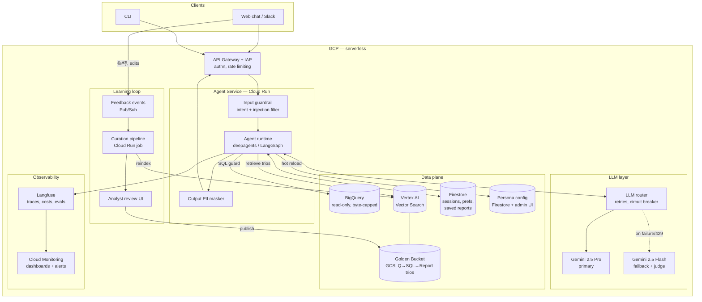
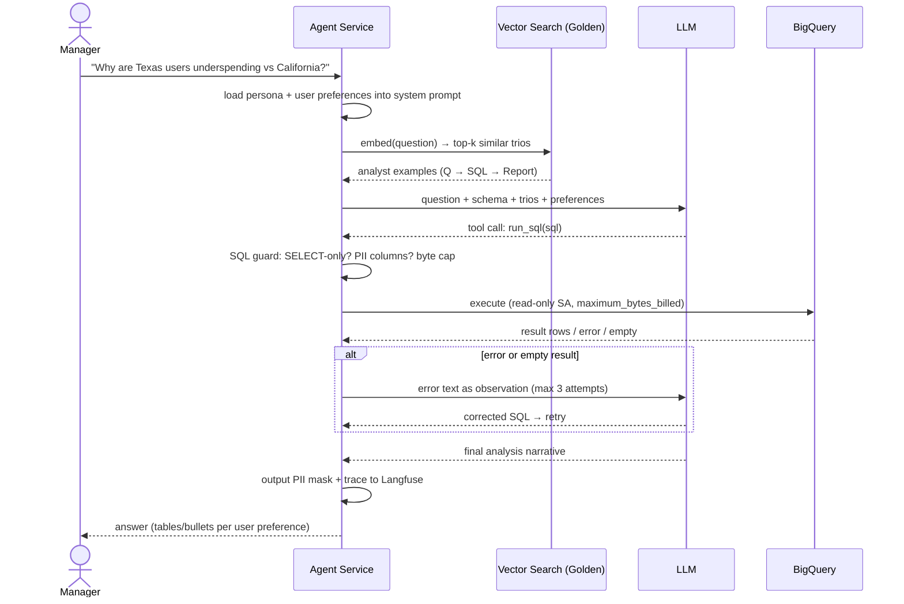
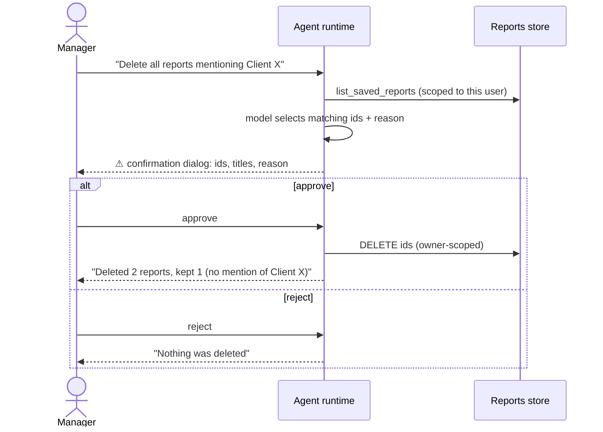
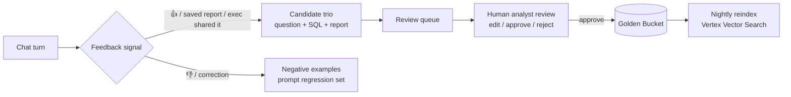

# Architecture — Data Analysis Chat Assistant

This document describes the production High-Level Design. The prototype in this
repository implements the same architecture end-to-end on lightweight local
substitutes (see [Prototype ↔ Production mapping](#prototype--production-mapping)).

## 1. System overview

**Compute**: everything is serverless (Cloud Run) — the agent is stateless
between turns; conversation state lives in Firestore (LangGraph checkpointer),
so any replica can serve any turn and scaling is horizontal per-request.

**Communication**: clients talk HTTPS/SSE (streaming tokens) to the Agent
Service; the agent talks to BigQuery/Firestore/Vector Search via Google client
libraries (IAM service accounts, no keys); feedback flows asynchronously
through Pub/Sub so the learning loop never blocks the chat path.

## 2. Query data flow

## 3. Destructive operations flow

The DB is read-only; the only destructive surface is the Saved Reports library.
Deletion is gated by a **hard interrupt** in the agent graph — the model cannot
execute the tool without an explicit human decision, and the approval is
enforced by the runtime (LangGraph human-in-the-loop), not by prompt goodwill.

UX notes: the flow adds exactly one click for the destructive case and zero
friction anywhere else; users can only ever delete their own reports (ownership
is enforced in the storage layer, not by the model).

## 4. Golden Bucket: retrieval and update loop

**At query time** the question is embedded and the top-k most similar trios are
retrieved and injected into the model context as worked examples. This transfers
analyst conventions the schema alone cannot teach (e.g. "revenue excludes
cancelled/returned items", "decompose 'underspending' into conversion ×
frequency × basket size").

**Over time** the bucket grows through a curated pipeline:

Key decisions:
- **Humans stay in the loop**: only analyst-approved trios enter the bucket, so
  one bad LLM answer can never poison future retrievals.
- Negative feedback becomes eval cases, hardening the regression suite.
- Trios are versioned in GCS; the index rebuild is a nightly batch job.

**In the prototype** the capture step of this pipeline is the `/good` CLI
command: it assembles a candidate trio from the last exchange — the user's
question, every SQL query the agent executed for it, and the final report —
and writes it to `golden/candidates/` with `pending_review` metadata.
Retrieval deliberately ignores the candidates folder; the human review step is
moving the (possibly edited) file into `golden/`, after which it is retrieved
on the very next question — no restart, no redeploy. Same gate, same
one-way door as production; only the transport (Pub/Sub, review UI, reindex)
is simplified to a folder move.

## 5. Prototype ↔ Production mapping

| Building block | Prototype (this repo) | Production |
|---|---|---|
| Agent runtime | deepagents + LangGraph, in-process | same code on Cloud Run, SSE streaming |
| LLM | Ollama Cloud (`kimi-k3:cloud`) + fallback model | Gemini 2.5 Pro + Flash fallback on Vertex AI |
| Golden Bucket | `golden/*.json` + lexical retrieval | GCS + embeddings in Vertex AI Vector Search |
| Sessions / checkpoints | in-memory checkpointer | Firestore checkpointer |
| Reports & preferences | SQLite (`data/app.db`) | Firestore (per-user collections) |
| Personas | `personas/*.yaml`, hot-reloaded each turn; editable by chat via `update_persona` (confirmation-gated) | Firestore config + admin UI + same chat editing, same hot reload |
| Observability | JSONL traces + `/trace`, `/metrics`; optional Langfuse (enabled by `.env` keys) | Langfuse + Cloud Monitoring dashboards/alerts |
| Learning-loop capture | `/good` → `golden/candidates/` + manual review (move into `golden/`) | Pub/Sub feedback events → curation job → analyst review UI → GCS publish + reindex |
| QA | `evals/` harness with LLM judge | same suite in CI + canary before rollout |
| Safety | SQL guard + PII deny-list + output masker | same, plus Cloud DLP scan and IAM-scoped SA |

The prototype was intentionally built with the same component boundaries as the
production design — every local substitute sits behind the same interface as
its cloud counterpart, so promotion is a matter of swapping adapters, not
rewriting the agent.
